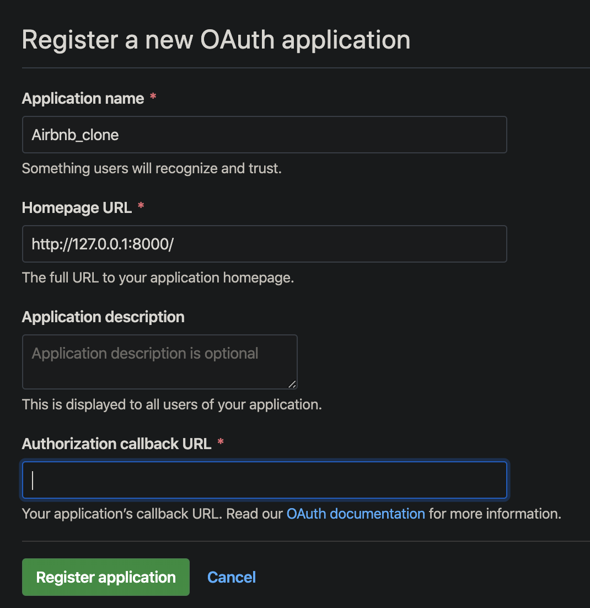
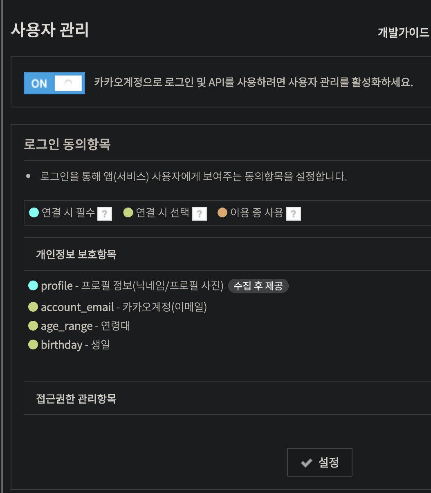
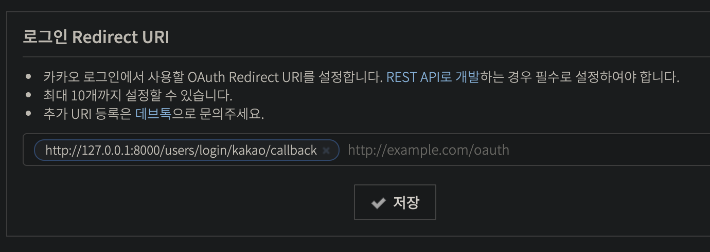

# 6. Users app: Login, Logout and Sign up


- **template: user interaction**
  - [sends {{form}} to forms.py](./templates/users/login.html)
  - [routes  to urls.py](./templates/partials/nav.html)
- **urls.py: connection between views.py and template**
  - urlpatterns
    - utilizes classes & functions from user app's views.py 
    - export views.py classes & functions to templates as name="name"
  - app_name: exports user's url routing to django project
- **views.py: controller which provides functions and methods from django classes** 
  - Classes & methods : FormView ...
  - Functions: render, redirect, reverse, authenticate, logout...
  - receives functions and methods from forms.py
  - **Through urls.py, supplies functions and methods to templates **
- **forms.py: branched off from views.py, receives forms from template and processes certain actions**
  - need to manually create a file in users app folder
  - **process get requests from template**
  - get queryset objects from models.py, validates password and username(=email)
  - **sends class and methods back to views.py**

### MVC Architecture in Django

From YouTube Cloning class:

- Model: Model represents shape of the data.
- View: View is a user interface.
- Controller: Controller handles the user request.

For Django project, if I were to match MVC architecture to individual python files:

- Model <-> models.py
- View <-> templates (.html & .css)
- Controller <-> views.py, forms.py

https://medium.com/shecodeafrica/understanding-the-mvc-pattern-in-django-edda05b9f43f


# 14 User Log in & Log out

- FormView to replace Django's default class LoginView

# 15 Sign Up 


# 16 Verify Email

https://docs.djangoproject.com/en/3.0/topics/email/

http://mailgun.com/

# 17 Log in with Github

- Github OAuth Documentation
  https://developer.github.com/apps/building-oauth-apps/authorizing-oauth-apps/
- Using Github OAuth
  https://github.com/settings/developers
  - Users are redirected to request their GitHub identity
  - Users are redirected back to your site by GitHub
  - Your app accesses the API with the user's access token



- views.py is redirecting to GitHub.
  "Authorization callback URL" is where github redirects to our webpage after authentification is completed at Github

- Refer to urls.py (router) for callback url

  ```
  http://127.0.0.1:8000/users/login/github/callback
  ```

  

# 18 Kakao Log in

https://developers.kakao.com/apps/409832/settings/user





